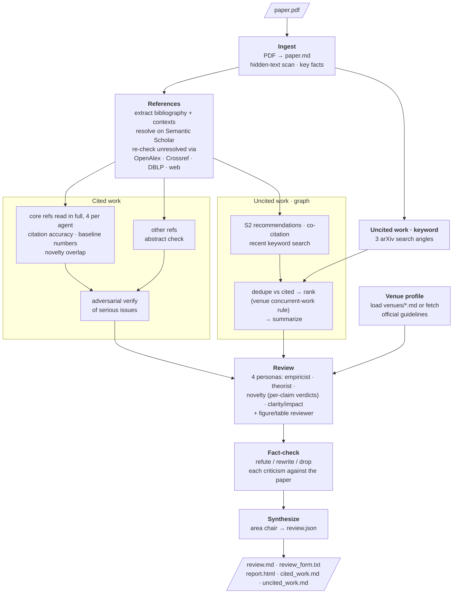

# agentic-reviewer

A multi-agent research-paper reviewer that runs as a Claude Code workflow, inspired by
[paperreview.ai](https://paperreview.ai). It is meant for authors who want fast, actionable
feedback on their **own** papers. Many venues forbid putting a paper you are reviewing into
an LLM tool (for example, NeurIPS 2026 bans outside LLMs for reviewers), so check your
venue's policy.

## Layout

| path | what |
| --- | --- |
| `.claude/workflows/paper-review.js` | the workflow |
| `.claude/settings.json` | shared project settings (allows the workflow to run) |
| `venues/<venue>-<year>.md` | reviewer guidelines + review form per venue (`_TEMPLATE.md` defines the format) |
| `scripts/save_review_json.py` | writes `review.json` from the workflow, checksum-verified, without an agent retyping it (stdlib only) |
| `scripts/render_review.py` | renders `review.json` into every output format (stdlib only) |
| `templates/report.html` | HTML report template |
| `examples/sample/` | example output for a fictional paper |

## Quick setup

Paste this into Claude Code to set everything up:

```
Clone https://github.com/jayin92/agentic-reviewer and cd into it, check that python3 (3.8+), curl and pdftotext (poppler) are installed and install any that are missing (brew install poppler on macOS, sudo apt install poppler-utils on Debian/Ubuntu), then ask me for my Semantic Scholar API key (optional) and save it as env S2_API_KEY in .claude/settings.local.json, and finally tell me to restart claude inside the repo and how to run the paper-review workflow.
```

## Manual setup

1. **Requirements**
   - [Claude Code](https://claude.com/claude-code) with workflows enabled
   - `python3` 3.8+ (the scripts use only the standard library)
   - `curl`
   - `pdftotext` from poppler, used for the hidden-text scan and for reading PDFs:
     `brew install poppler` on macOS, `sudo apt install poppler-utils` on Debian/Ubuntu
2. **Clone the repo**
   ```bash
   git clone https://github.com/jayin92/agentic-reviewer.git
   cd agentic-reviewer
   ```
3. **Semantic Scholar API key** (optional, but recommended). Request one at
   <https://www.semanticscholar.org/product/api#api-key-form>, then create
   `.claude/settings.local.json` (already gitignored):
   ```json
   { "env": { "S2_API_KEY": "your-key" } }
   ```
   You can also `export S2_API_KEY=...` before you start `claude`. The workflow runs without a
   key, but Semantic Scholar throttles unauthenticated requests heavily.
4. **Start Claude Code from the repo root** (`claude`). The workflow lives in
   `.claude/workflows/`, so Claude only finds it when you start from this directory.
   `.claude/settings.json` already allows `Workflow(paper-review)`.

Put the PDFs you want reviewed in `papers/`. Both `papers/` and `reviews/` are gitignored so that
manuscripts and reviews never get committed.

## Run

In Claude Code, from this directory:

```
run the paper-review workflow on papers/my-paper.pdf with venue "CVPR 2026"
```

Args: `{paper, venue?, outDir?, maxCore?: 20, maxRelated?: 12, maxDetailed?: 5}`.

- `venue` accepts `"CVPR 2026"`, `"cvpr"` (latest profile), `"NeurIPS 2026"`, etc. If no profile
  exists, an agent fetches the official reviewer guidelines and writes `venues/<venue>-<year>.md`
  with `verified_by_human: false`. Check it before relying on it; later runs reuse it.
- Without a venue you get a generic review with the 7 dimension scores.

## Output

Everything lands in `reviews/<pdf-name>/`:

| file | contents |
| --- | --- |
| `review.md` | the review: summary, fact-checked weaknesses with fixes, novelty table, citation checks, missing related work, questions, revision checklist, scores |
| `review_form.txt` | the venue's review form, filled field by field in the official order |
| `report.html` | the same review as an interactive page (filters, collapsible evidence, revision checklist) |
| `review.json` | all structured data; use it to compare revisions of your paper |
| `cited_work.md` | every reference with its verdicts on citation accuracy, baseline numbers and novelty overlap |
| `uncited_work.md` | related papers the article does not cite, grouped by category |
| `references.json` | bibliography resolved against Semantic Scholar |
| `paper.md` | Markdown transcription of the PDF |

To re-render after editing `review.json`: `python3 scripts/render_review.py reviews/<pdf-name>`.
To share the HTML report, ask Claude to publish `report.html` as an artifact.

Venue-form scores and dimension scores are **uncalibrated** AI estimates.

## Pipeline



A typical paper uses about 28 agents. Reviews are AI-generated and may contain errors.

## License

[MIT](LICENSE)
